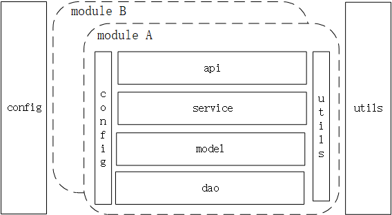

# golang-web-project-framework
Golang Web Project Framework is standards and specifications of web project, which defines project framework, directory structure and so on.
It makes web project clearer and easier to understand, and ensures the unity of style when developers code.

## Contents
- [Golang Web Project Framework](#golang-web-project-framework)
  - [Contents](#contents)
  - [Project Framework](#project-framework)
    - [Config](#config)
    - [Modules](#modules)
      - [Api](#api)
      - [Service](#service)
      - [Model](#model)
      - [Dao](#dao)
    - [Utils](#utils)
  - [Directory Structure](#directory-structure)
  - [To be Continue](#to-be-continue)

## Project Framework

### Config
Public Config, which can be used by any others.

### Modules
Split by module or function first, then layer the module.

Tips:

1.layer the project first, it will be large and redundancy in the late stages.

2.As the project gets bigger and bigger, maybe some modules will be independent.

#### Api
It contains router, and handlers which are responsible for parsing paramters.

#### Service
It is responsible for validate paramters and business logic processing, then invokes model layer.

Attention: Never allow use model or dao B through Service A, but Service A to Service B, then Service B invokes model B.

#### Model
It indicates concrete instantiated object, which matches with database.

#### Dao
Encapsulating access to the database: adding, deleting, Updating and querying.Do not involve business logic.

### Utils 
Public function part, which can be used by any others.

## Directory Structure
| directory | description |
| :---- | :---- |
| build/ | compile and package files |
| config_files/ |  configuration file |
| docs/ | design documents |
| src | code directory |
| \|---cmd | entrance of code running |
| \|---config | parse configuration files |
| \|---modules | functional modules |
| \|---utils | public function part |
| \|---vendor | library code which the project depends |

## To be Continue
