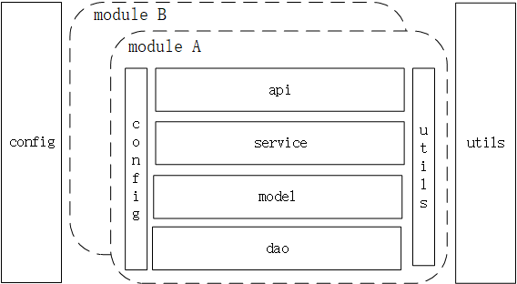

# golang-web-project-framework
Golang Web Project Framework is standards and specifications of web project, which defines project framework, directory structure and so on.
It makes web project clearer and easier to understand, and ensures the unity of style when developers code.

## Project Framework

### Modules
Split by module or function first, then layer the module.

Tips:

1.layer the project first, it will be large and redundancy in the late stages.

2.As the project gets bigger and bigger, maybe some modules will be independent.

### Config
Public Config, which can be used by any others.

### Utils 
Public function part, which can be used by any others.

## To be Continue...
